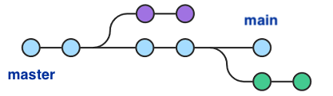

# master-to-main
A repo to show how to move the default branch from 'master' to 'main' and remove the 'master' branch

The following is a simple 5-step process to take a step forward in removing 
divisive language in tech by changing the default branch name in a repo 
to 'main' and removing references to 'master'. Screenshots are available in the 
[img/](./img/) directory. More detailed instructions can be found here: 
https://stevenmortimer.com/5-steps-to-change-github-default-branch-from-master-to-main/

----

**Steps**

  1. Step 1 - Create the 'main' branch
  2. Step 2 - Push 'main' to remote repo
  3. Step 3 - Point HEAD to 'main' branch
  4. Step 4 - Change default branch to 'main' on GitHub site
  5. Step 5 - Delete 'master' branch on the remote repo

**Code**

```sh
# Step 1 
# create main branch locally, taking the history from master
git branch -m master main

# Step 2 
# push the new local main branch to the remote repo (GitHub) 
git push -u origin main

# Step 3
# switch the current HEAD to the main branch
git symbolic-ref refs/remotes/origin/HEAD refs/remotes/origin/main

# Step 4
# change the default branch on GitHub to main
# https://docs.github.com/en/github/administering-a-repository/setting-the-default-branch

# Step 5
# delete the master branch on the remote
git push origin --delete master
```
